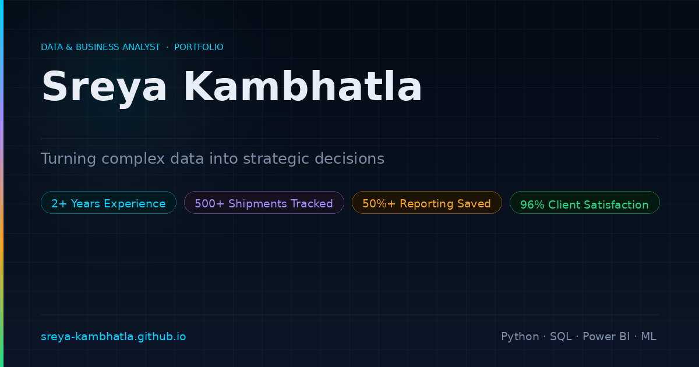

# Sreya Kambhatla — Data & Business Analyst Portfolio

---

## Preview

> **[→ View Live Site](https://sreya-kambhatla.github.io/Portfolio_v04/)**

---

## About

Personal portfolio for **Sreya Kambhatla**, Data & Business Analyst with 2+ years of experience across logistics, media operations, and university research. Built from scratch — no frameworks, no build step, no dependencies beyond a single CDN script.

---

## Features

### Visuals & Animations
- **Animated particle canvas** — 70-node network with cyan/purple nebula glow, runs full-page behind all content
- **Scroll-triggered reveal** — elements animate in as they enter the viewport (works on GitHub Pages, `file://`, and iframes)
- **Spinning gradient profile ring** — conic gradient animation on the hero photo
- **Shimmer wave timeline** — soft light sweep travels left-to-right across the experience timeline on loop

### Sections
- **Hero** — name, role, bio, social links, resume download, 3 key stats
- **Education Timeline** — vertical center-spine with alternating left/right cards, 4-color gradient spine, left/right slide-in animations
- **Work Experience** — horizontal 4-job timeline with per-company color coding (cyan/purple/amber/green), hover-expand detail panels
- **Manager Quotes** — auto-rotating quotes with per-company color matching, manual dot navigation
- **Tech Stack** — 5-panel asymmetric grid (Programming · DS & ML · Frameworks · Cloud · Visualization), subtle tinted glass chips
- **Contact** — Outlook-style compose panel powered by EmailJS, social/calendar links

### Engineering
- **CI/CD** via GitHub Actions — validates HTML structure, smoke-tests CSS/JS, regenerates OG image on every push
- **Open Graph image** — auto-generated via Python/Pillow; appears as preview card when link is shared on LinkedIn, Twitter, Slack
- **Favicon** — inline SVG data URI
- **Responsive** — mobile-friendly layout at 900px and 560px breakpoints

---

## Contact

| | |
|---|---|
| **Email** | sreyakambhatla@outlook.com |
| **LinkedIn** | [linkedin.com/in/sreya-kambhatla](https://www.linkedin.com/in/sreya-kambhatla/) |
| **GitHub** | [github.com/sreya-kambhatla](https://github.com/sreya-kambhatla) |
| **Book a call** | [calendly.com/sreyakambhatla/30min](https://calendly.com/sreyakambhatla/30min) |
